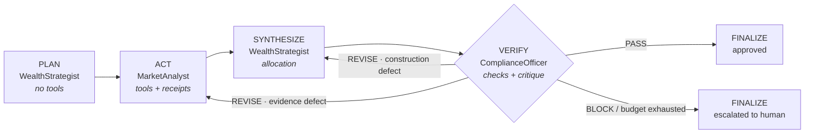
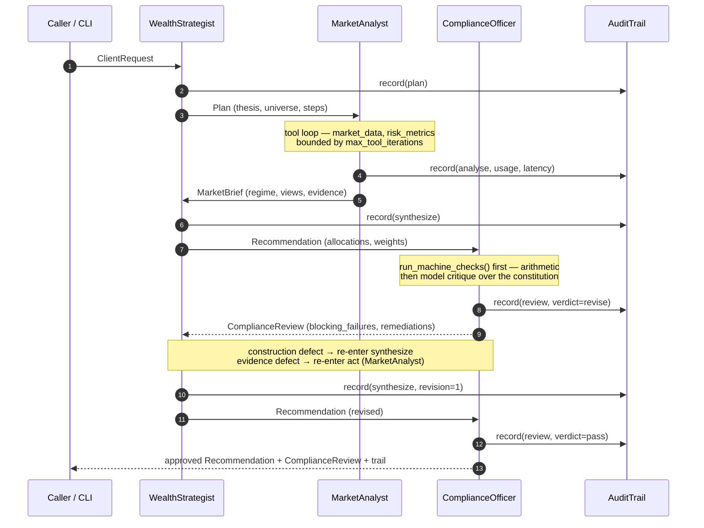
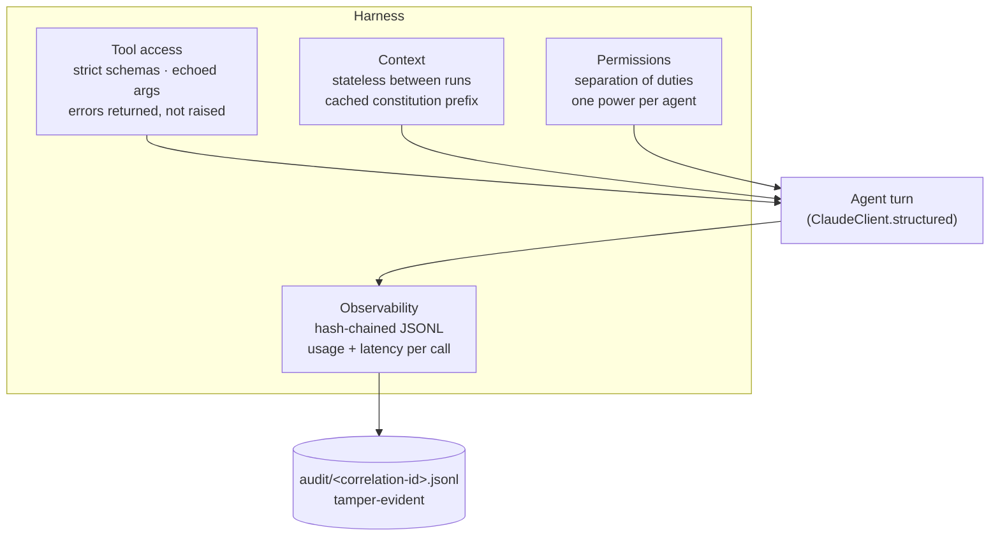
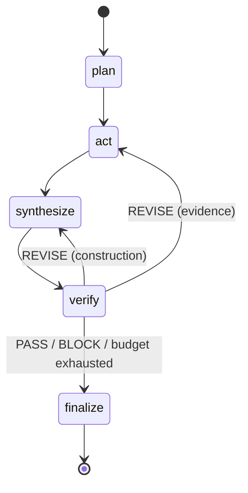
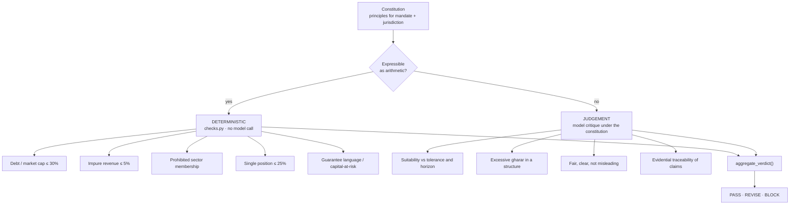

# SPEC.md — FinAgent-Nexus Technical Specification

| | |
| --- | --- |
| **Name** | finagent-nexus |
| **Version** | 0.1.0 |
| **Goal** | Agentic AI adoption for financial services — closing the gap between AI potential and financial services reality |
| **Domain** | Wealth management, retail & corporate banking, private banking, SME banking, insurance |
| **Outcome** | A production-shaped agentic system whose compliance, auditability, and cost are properties of the architecture rather than promises about it |
| **Runtime** | Python ≥ 3.11 · LangGraph · Anthropic Claude (`claude-opus-5`) |

---

## 1. Project Overview

### 1.1 Problem statement

Agentic pilots in financial services fail at the same seam. The model works; the *system around it* cannot answer the four questions a second line of defence asks before anything reaches a client:

1. **What evidence supports this figure?**
2. **Which rule was checked, by what, and with what result?**
3. **Who or what decided the outcome, and can that decision be re-run?**
4. **What did this cost, and what will it cost at ten thousand times the volume?**

A system that cannot answer these is not deployable, however good its output. FinAgent-Nexus is built so that each answer is a lookup rather than an investigation.

### 1.2 Scope

**In scope.** Multi-agent orchestration, Shari'ah and regulatory verification, evidence traceability, tamper-evident audit, an evaluation harness, and cost instrumentation.

**Out of scope.** Order execution, custody, KYC onboarding, live market connectivity, and any regulated advice. The bundled `SyntheticMarketData` provider is a deterministic stand-in so the repository is runnable and the evaluation suite is reproducible; it must be replaced before any live use.

### 1.3 Non-negotiable invariants

These hold for every run and every mandate. Each is enforced structurally — by graph topology or by pure Python — never by asking a model to comply.

| # | Invariant | Enforced by |
| --- | --- | --- |
| I1 | No recommendation reaches an outcome without compliance review | Graph topology: no `synthesize → finalize` edge (`graph.py`) |
| I2 | Deterministic screens are decided by arithmetic, not by a model | `checks.py`, called before the review prompt is built |
| I3 | The verdict is computed in Python from structured findings | `aggregate_verdict()` (`agents/compliance_officer.py`) |
| I4 | Unproven ⇒ not approved (fail-closed) | `UNVERIFIABLE` on a non-advisory principle counts as a failure |
| I5 | Cited evidence corresponds to executed tool calls | `MarketAnalyst.run()` overwrites model-authored evidence with dispatcher receipts |
| I6 | Every loop is bounded | `max_revisions`, `max_tool_iterations`, LangGraph `recursion_limit` |
| I7 | Retroactive edits to the record are detectable | SHA-256 hash chain (`audit.py`) |
| I8 | A missing finding cannot cause a pass | `ComplianceOfficer._reconcile()` synthesises `UNVERIFIABLE` |

---

## 2. Plan-Act-Verify Loops

The loop is the system's spine. Each phase has a distinct owner, a typed output contract, and an explicit definition of done.

### 2.1 Plan

**Owner:** WealthStrategist · **Output:** `Plan` · **Tool access:** none

Converts a `ClientRequest` into an executable plan: a thesis, a concrete instrument universe of four to ten symbols, and steps assigned to agents.

Two constraints make the plan useful rather than decorative:

- **Every step carries an observable success criterion.** "Analyse the market" is rejected by prompt; "establish 12-month volatility and maximum drawdown for each proposed holding" is a step whose completion can be checked.
- **The planner has no tools, and is told so.** It cannot state prices or ratios, because a plan that asserts numbers commits the desk to figures nobody looked up.

### 2.2 Act

**Owner:** MarketAnalyst · **Output:** `MarketBrief` · **Tool access:** full

The only agent permitted to touch market data — a containment boundary, not a convenience. If a figure appears anywhere downstream, it entered here.

Tool surface (`tools/__init__.py`), all declared `strict: true` so arguments are validated at the API boundary:

| Tool | Returns |
| --- | --- |
| `get_quote` | Price, day change, currency, sector, market cap |
| `get_price_history` | First/last/high/low and period return over N trading days |
| `compute_risk_metrics` | Annualised return and volatility, Sharpe, max drawdown, historical 95% VaR and CVaR |
| `get_screening_data` | Sector, instrument kind, and the three AAOIFI ratios |
| `list_universe` | Symbols available, optionally pre-filtered to Shari'ah-eligible |

**The evidence guarantee.** The model returns an `evidence` list; `MarketAnalyst.run()` discards it and substitutes `LLMResult.evidence()` — one line per tool call the dispatcher actually executed, arguments echoed. Fabricated citations are not detected after the fact; they are structurally impossible.

### 2.3 Verify

**Owner:** ComplianceOfficer · **Output:** `ComplianceReview` · **Tool access:** none

Three stages, in strict order:

**Stage 1 — deterministic screens (`checks.py`).** Eight machine checks run as pure functions over the recommendation and reference data. A 31% debt ratio fails; there is no prompt to negotiate with, and an auditor reproduces the result offline with no API key.

**Stage 2 — constitutional critique.** Qualitative principles only. The machine findings are supplied to the model as *established facts* it is instructed not to re-litigate, which keeps the reviewer's attention on judgement rather than arithmetic. `_reconcile()` then drops findings for principles that were not requested and synthesises `UNVERIFIABLE` for any that were silently skipped.

**Stage 3 — verdict derivation.** `aggregate_verdict(findings, revisions_remaining)` maps findings to an outcome:

| Condition | Verdict |
| --- | --- |
| Blocking failure with no remediation offered | `BLOCK` — another pass cannot fix it |
| Any blocking or material failure, revision budget remaining | `REVISE` |
| Any blocking or material failure, budget exhausted | `BLOCK` — escalate to a human |
| Advisory failures only | `PASS`, with caveats attached |
| No failures | `PASS` |

`UNVERIFIABLE` on any non-advisory principle is treated as a failure throughout.

> **This function is your institution's risk appetite expressed as code.** A private bank may allow a material breach to pass with sign-off; a retail platform will not. It is deliberately one small function with its own test file, so tuning it is a reviewable pull request rather than an untracked prompt edit.

### 2.4 The revision loop

A `REVISE` verdict routes back into Act or Synthesize depending on **which principle broke**, read from structured findings — never by pattern-matching remediation prose:

- Breached principle in `REQUIRES_NEW_EVIDENCE` (the Shari'ah screens, evidential traceability, sanctions) → **Act**. Substituting an instrument demands fresh screening data.
- Anything else (weights, concentration, disclosure, suitability, fair presentation) → **Synthesize**. Rebuilding an allocation does not require re-opening settled evidence.

That routing table lives in `constitution.py` beside the rules, so adding a principle forces an explicit decision about who owns fixing it.



The same loop expressed as message flow, with the payload contract on every hop and the audit
write that accompanies each phase. Source: [`docs/diagrams/agent-interaction.mmd`](docs/diagrams/agent-interaction.mmd).



Note that the ComplianceOfficer never returns an amended allocation — only findings and remediations.
Authorship stays with the WealthStrategist; the reviewer cannot become the author of what it approves.

---

## 3. Harness Engineering

The harness is everything around the model that makes its output usable. Four concerns, each with one owner in the codebase.

### 3.1 Tool access

Tools are the only channel to the outside world, and the channel is narrow by design.

- **One tool per question an analyst actually asks.** No generic `query()` escape hatch — a broad tool surface is an unbounded audit surface.
- **Arguments echoed in every result.** `{"symbol": "2222.SR", "price": 28.4}` can be reconciled against a claim; a bare `28.4` cannot.
- **`strict: true` on every schema.** Malformed arguments are rejected at the API boundary, not three frames into Python.
- **Errors are returned, never raised.** An unknown symbol is information the model should react to — `(payload, is_error=True)` — not a crash that discards the run.
- **The dispatcher is stateless.** `ToolDispatcher.__call__` is a pure function of `(name, arguments)` given a provider, which is what makes replaying an audit trail meaningful.

### 3.2 Memory and context

The system is deliberately **stateless between runs**. Context lives in the typed graph state for the duration of one mandate and is then discarded to the audit trail.

This is a governance choice before it is an engineering one. Cross-run memory means a recommendation can be influenced by material no auditor sees in the file for that decision. Where an institution genuinely needs continuity — a client's stated preferences across reviews — it belongs in an explicit, inspectable store loaded into `ClientRequest.constraints`, not in an opaque agent memory.

Within a run, context is managed by:

- **Prompt caching on the stable prefix.** The constitution is rendered deterministically — no timestamps, no shuffling — and marked `cache_control: ephemeral`. On a multi-revision run the same rules are re-sent each pass; cache hits are visible as `cache_read_input_tokens` in every audit summary.
- **Compact tool results.** `get_price_history` returns five summary statistics rather than 252 floats. Transcript size is a cost line and a legibility problem.

### 3.3 Permissions and separation of duties

Capability is assigned per agent and enforced by construction, not by instruction:

| Agent | Market data | Sets weights | Renders verdict |
| --- | --- | --- | --- |
| MarketAnalyst | ✅ sole holder | ❌ | ❌ |
| WealthStrategist | ❌ | ✅ sole holder | ❌ |
| ComplianceOfficer | reference data only | ❌ | ❌ — reports findings |
| Orchestrator (LangGraph) | ❌ | ❌ | ✅ via `aggregate_verdict` |

No agent holds two of the three powers. The analyst cannot allocate to its own favoured name; the strategist cannot manufacture the evidence supporting it; the reviewer cannot approve its own reasoning.

### 3.4 Observability

Every model call produces an audit event carrying actor, action, status, structured detail, model id, token usage, and latency. `AuditTrail.summary()` rolls a run up into the numbers an operator needs: event count, chain validity, tokens in/out, cache reads, and total model time.

The **hash chain** is the property that distinguishes a log from a record. Each event embeds the SHA-256 of its predecessor over a canonical JSON encoding — sorted keys, no incidental whitespace — so a dict-ordering change does not break the chain but an edited field does. `finagent verify-audit <file>` recomputes it from the file alone, with no credentials and no trust in this codebase.



---

## 4. Graph Engineering

### 4.1 Why a state machine and not a conversation

Conversational multi-agent frameworks let agents decide who speaks next. That makes control flow a model output — and control flow a model can rewrite is control flow a compliance function cannot certify.

Here the graph is fixed at compile time in `build_graph()`. Nodes, edges, and the branch function are all readable in one screen, and no agent can add an edge at runtime.

### 4.2 Topology



The single most important feature of this diagram is an edge that is **absent**: `synthesize → finalize`. Verification is not a step that can be skipped under load, disabled by a flag, or bypassed by a model deciding it is unnecessary.

### 4.3 Error handling

Failure is a state, not an exception. The `_guard` decorator wraps every node:

| Failure | Recorded as | Result |
| --- | --- | --- |
| `ModelRefusal` (safety decline) | `status="refused"` with category and explanation | `halted` — a governance event, never a blind retry |
| `AgentError` (schema violation, tool-loop exhaustion) | `status="error"` with the message | `halted` |
| Missing prerequisite state | `status="error"` | `halted` |

A halted run still drains to `finalize`, so the trail is closed properly rather than the process dying mid-record. Transient transport failures are handled beneath this layer by the SDK's own retry policy (connection errors, 408/409/429/5xx with exponential backoff).

### 4.4 Bounded execution

Three independent bounds, because one is a single point of failure:

| Bound | Setting | Enforced in |
| --- | --- | --- |
| Revision loops | `max_revisions` (default 2) | `route_after_verify` |
| Tool iterations per turn | `max_tool_iterations` (default 8) | `ClaudeClient.structured` |
| Total node visits | `recursion_limit = (max_revisions + 1) × 3 + 10` | LangGraph |

### 4.5 Extensibility

Adding an agent is: define its typed output model, write the node, add the edge, extend the constitution if it introduces new obligations, and add golden cases. The current graph is strictly sequential — which is what permits a single hash chain. **If you add parallel fan-out, give each branch its own sub-chain and merge with an explicit reducer**; do not mutate one `AuditTrail` from two branches. This constraint is documented at `NexusState.trail`.

---

## 5. Compliance & Governance

### 5.1 The constitution as a signed artefact

`constitution.py` holds fourteen principles, each carrying an id, title, citable source, severity, applicable mandates, and either a deterministic check id or nothing. It is a plain Python file for one reason: a Shari'ah board or a compliance function can read it, sign it off, and every subsequent change appears in a diff with an author and a date.

| Group | Principles |
| --- | --- |
| **Shari'ah** (AAOIFI SS 21, 31) | Riba prohibition; leverage screen (30%); interest-bearing securities screen (30%); impure revenue screen (5%); prohibited sectors; gharar; purification disclosure |
| **Regulatory** (MiFID II, FCA COBS, SAMA, SCA, FATF, EU AI Act Art. 12, SR 11-7) | Suitability; concentration limit; allocation integrity; risk disclosure and absence of guarantees; evidential traceability; fair, clear and not misleading; sanctions exposure |

Screening thresholds follow AAOIFI Shari'ah Standard No. 21. Methodologies differ materially — Dow Jones Islamic Market and S&P Shariah screen debt against a 36-month average market capitalisation rather than total assets. **Choosing between them is a governance decision, not a technical one**; edit `SHARIA_THRESHOLDS`, re-run the evaluation harness, and record the board's approval.

### 5.2 The determinism boundary

The single most consequential design line in the system:

| Decided by arithmetic (`checks.py`) | Decided by judgement (model critique) |
| --- | --- |
| Debt / market cap ≤ 30% | Suitability against stated tolerance and horizon |
| Interest-bearing securities ≤ 30% | Excessive gharar in a proposed structure |
| Impure revenue ≤ 5% | Fair, clear and not misleading presentation |
| Prohibited sector membership | Evidential traceability of qualitative claims |
| Riba-bearing instrument kind | Purification disclosure adequacy |
| Weights sum to 100%, long-only | |
| Single position ≤ 25% | |
| Guarantee language / capital-at-risk disclosure | |

Everything on the left is reproducible offline, forever, at zero marginal cost. Move a rule leftward whenever you can express it as arithmetic — that is the cheapest compliance improvement available.

Source: [`docs/diagrams/determinism-boundary.mmd`](docs/diagrams/determinism-boundary.mmd).



Arithmetic findings are not overridable by model critique — but note *where* that guarantee comes
from. It is not vote-weighting at aggregation: `aggregate_verdict` keys entirely off `severity`, so
a machine finding and a model finding of equal severity carry equal weight. The guarantee is placed
one step earlier, in what the reviewer is asked. The model receives deterministic results under the
heading *"ESTABLISHED FACTS … Already decided. Use them as context; do not re-judge or repeat them"*,
is instructed to return findings for the qualitative principles *"and nothing else"*, and
`_reconcile` then filters its response back down to exactly that set. A verdict the model cannot
reach is more robust than one it is merely discouraged from reaching: a rule a model can argue its
way past is not a control.


### 5.3 Audit record

One JSONL file per run, named for its correlation id.

```json
{
  "seq": 4,
  "ts": "2026-08-25T09:14:03.221000Z",
  "correlation_id": "9f2c7ab41d6e4f0b8c3a5e17d92b6408",
  "actor": "ComplianceOfficer",
  "action": "review",
  "status": "revise",
  "detail": {
    "revision": 0,
    "revisions_remaining": 2,
    "verdict": "revise",
    "findings": {"SHARIA-SCREEN-02": "pass", "REG-CONC-02": "fail"},
    "blocking_failures": ["[material] REG-CONC-02: One or more positions exceed the 25% limit."],
    "remediations": ["REG-CONC-02: Trim 2222.SR at 31.0% to at most 25% and redistribute."]
  },
  "model": "claude-opus-5",
  "usage": {"input_tokens": 12184, "output_tokens": 1902, "cache_read_input_tokens": 9856},
  "latency_ms": 7314,
  "prev_hash": "b41d…",
  "hash": "7e0a…"
}
```

Field semantics are fixed by `AuditEvent`. Timestamps are ISO-8601 UTC with a `Z` suffix. For the full control, pair the trail with write-once storage (S3 Object Lock or a WORM volume) — the hash chain makes tampering *detectable*, not impossible.

### 5.4 Human escalation

`BLOCK` is not a failure mode; it is the system correctly declining to proceed. It occurs when a blocking principle fails with no available remediation, or when the revision budget is exhausted with defects outstanding. The state carries the failing principles, their evidence, and the remediations attempted, so the human receives a file rather than an alert.

### 5.5 Evaluation as a governance control

`tests/eval/` holds golden cases with known-correct verdicts, including deliberately non-compliant portfolios that must be caught. The suite is the regression test for the constitution itself: a threshold edit that silently stops catching a breach fails the build. Model risk management frameworks (SR 11-7 and equivalents) require ongoing monitoring — this is where it lives.

---

## 6. ROI Metrics

Every metric below is instrumented in this repository. None requires a new measurement programme; the baselines are yours to supply.

| Dimension | Metric | Source | Why it moves |
| --- | --- | --- | --- |
| **Speed** | Wall-clock and model-time per mandate | `AuditTrail.summary()["latency_ms"]` | Analysis, construction, and first-pass review run without queueing for human availability |
| **Speed** | Time to production | Days from mandate to sign-off | Governance artefacts exist on day one instead of being retrofitted during model validation |
| **Accuracy** | Catch rate per principle | `tests/eval/` per-case report | Deterministic screens catch every arithmetic breach by construction |
| **Accuracy** | First-pass approval rate | `revisions_used == 0` across audit trails | Rises as prompts and the instrument universe are tuned; a direct measure of system maturity |
| **Cost** | Tokens per decision | `usage` totals per run | Prompt caching on the constitution prefix; per-agent model routing; bounded loops |
| **Cost** | Cache efficiency | `cache_read_input_tokens ÷ input_tokens` | Multi-revision runs re-send an identical rules prefix; a falling ratio signals a silent cache invalidator |
| **Cost** | Rework avoided | Blocking failures per 100 runs | A breach caught pre-issuance costs a revision loop; caught post-issuance it costs a remediation programme |
| **Scalability** | Marginal cost of a new mandate type | Lines changed to add a constitution section | The graph, audit chain, and harness are domain-independent |

**How to establish a baseline.** Run your existing process on twenty representative mandates and record: analyst hours, compliance review hours, revision cycles, and elapsed days. Run the same twenty through this system. The delta is your business case, in your numbers, with an audit trail behind each figure.

**Guardrails on the claim.** First-pass approval rate is the metric to watch, not throughput — a system that produces more recommendations that all need rework has moved cost, not removed it. And measure the review *tail*: the value of automated screening is that human reviewers stop spending time on arithmetic and start spending it on judgement cases, which should make the median review faster and the hardest ones slower.

---

## 7. Future Extensions

| Extension | What it adds | Where it attaches |
| --- | --- | --- |
| **MCP integration** | Institution-hosted market data, CRM, and policy servers behind one protocol | Replace `ToolDispatcher` with an MCP client; `TOOL_SPECS` becomes a server-side tool list |
| **A2A interoperability** | Cross-institution agent negotiation — custody, execution, counterparty checks | New graph nodes with their own constitution sections; the audit chain already carries the correlation id |
| **Human-in-the-loop checkpoints** | Explicit approval gates on `BLOCK`, with resumable state | LangGraph checkpointer + `interrupt_before=["finalize"]` |
| **Portfolio optimisation** | Replace judgement-based weights with mean-variance or risk-parity under compliance constraints | New node between `act` and `synthesize`; constitution becomes the constraint set |
| **Full covariance risk** | Replace the single-correlation approximation in `portfolio_volatility_pct` | `tools/risk_metrics.py`, isolated by design |
| **Domain repointing** | Healthcare, legal, insurance underwriting | Swap `constitution.py` and the tool surface; the graph, audit, and eval harness are unchanged |
| **Marketplace packaging** | Deployable per-segment configurations | Constitution modules per jurisdiction and mandate type |

---

## 8. Diagrams

Rendered inline above and maintained as source in [`docs/diagrams/`](docs/diagrams/):

| Diagram | Shows | Source |
| --- | --- | --- |
| **Plan-Act-Verify loop** | Phase ownership, output contracts, both revision paths | `docs/diagrams/plan-act-verify.mmd` |
| **Harness** | Tools, context, permissions, observability converging on one agent turn | `docs/diagrams/harness.mmd` |
| **Graph orchestration** | Node topology, branching, bounded retries, the absent bypass edge | `docs/diagrams/graph.mmd` |
| **Agent interaction** | Message and evidence flow between the three agents across a revision | `docs/diagrams/agent-interaction.mmd` |
| **Determinism boundary** | Which principles are arithmetic and which are judgement | `docs/diagrams/determinism-boundary.mmd` |

---

## Appendix A — Configuration

| Variable | Default | Effect |
| --- | --- | --- |
| `ANTHROPIC_API_KEY` | — | Unset is fine when authenticated via `ant auth login` |
| `FINAGENT_MODEL` | `claude-opus-5` | Orchestration and compliance. Downgrading the reviewer is a governance decision, not a cost decision |
| `FINAGENT_ANALYST_MODEL` | `claude-opus-5` | Analyst only; the natural place to route down for high-volume desks |
| `FINAGENT_EFFORT` | `high` | `low` … `max`. Raise to `xhigh` for complex mandates |
| `FINAGENT_MAX_REVISIONS` | `2` | Revision budget before escalation |
| `FINAGENT_MAX_TOOL_ITERATIONS` | `8` | Tool-loop ceiling per agent turn |
| `FINAGENT_AUDIT_DIR` | `./audit` | Empty keeps trails in memory only |
| `FINAGENT_ALLOW_SYNTHETIC_DATA` | `false` | Permits the synthetic fixture as an implicit fallback. **Opt-in by design** — a runner with no real provider raises rather than quietly fabricating prices |

Adaptive thinking is enabled on every call; depth is controlled by `effort` rather than a fixed token budget.

## Appendix B — Type contracts

| Type | Produced by | Consumed by |
| --- | --- | --- |
| `ClientRequest` | Caller / CLI | All three agents |
| `Plan` | WealthStrategist (plan) | MarketAnalyst |
| `MarketBrief` | MarketAnalyst | WealthStrategist, ComplianceOfficer |
| `Recommendation` | WealthStrategist (synthesize) | ComplianceOfficer, caller |
| `ComplianceFindings` | ComplianceOfficer (model output) | `aggregate_verdict` |
| `ComplianceReview` | ComplianceOfficer (derived) | Router, caller |
| `AuditEvent` | `AuditTrail.record` | Auditor, `verify-audit` |

Each payload model is also the JSON schema handed to Claude via structured outputs, so a malformed response fails at the boundary rather than three nodes later.
