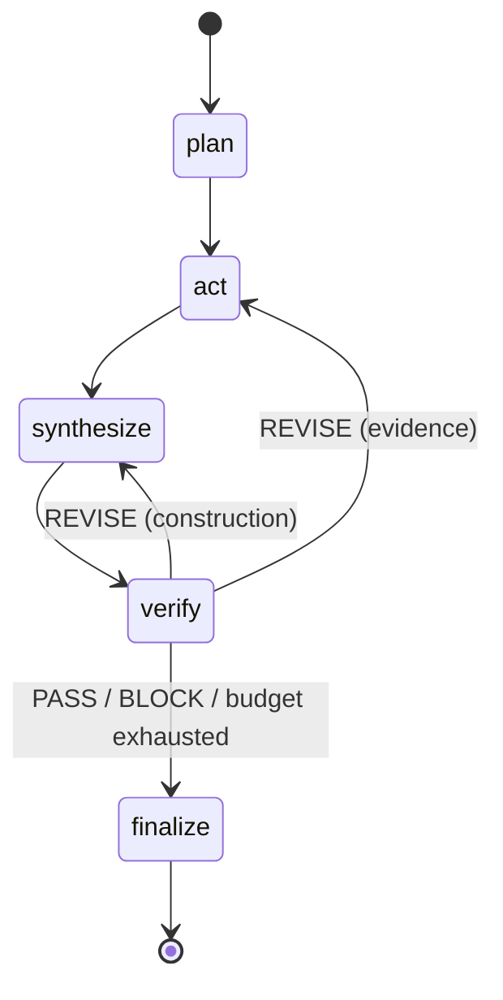

# Architecture

How FinAgent-Nexus is put together, module by module. This document covers **structure** —
what depends on what, and where to make a given change. For the methodology (Plan-Act-Verify,
verdict semantics, ROI model) see [`SPEC.md`](../SPEC.md); for the control framework see
[`governance.md`](governance.md).

---

## 1. The shape of the system

Three agents, one fixed graph, one audit trail:



Source: [`diagrams/graph.mmd`](diagrams/graph.mmd). Diagram sources for every figure in the
repository live in [`diagrams/`](diagrams/).

The load-bearing property is the edge that does **not** exist: `synthesize → finalize`. There is
no path from a drafted recommendation to an approved one that avoids verification. It cannot be
skipped under load, disabled by a flag, or bypassed by a model deciding it is unnecessary —
because it was never wired.

---

## 2. Module map

| Module | Responsibility | Depends on |
| --- | --- | --- |
| `state.py` | Every typed contract crossing an agent boundary | pydantic only |
| `config.py` | All cost / latency / governance knobs, snapshotted into the trail | stdlib |
| `constitution.py` | The versioned principle set, severity, and routing ownership | `state`, check ids |
| `checks.py` | Deterministic arithmetic screens — no model call | `state` |
| `verdict.py` | Risk-appetite policy: findings → PASS / REVISE / BLOCK. No model call | `constitution`, `state` |
| `llm.py` | The single Claude access layer: typed output, bounded tool loops, usage accounting | anthropic SDK |
| `audit.py` | Hash-chained JSONL trail and verification | stdlib |
| `agents/market_analyst.py` | Evidence gathering under tools | `llm`, `tools` |
| `agents/compliance_officer.py` | `run_machine_checks` → model critique → `aggregate_verdict` | `checks`, `constitution`, `llm` |
| `agents/wealth_strategist.py` | Plan, then synthesise the allocation | `llm` |
| `graph.py` | Node wiring, `_guard`, routing, bounded execution | all of the above |
| `tools/` | The analyst tool surface and the market data Protocol | stdlib |

**Dependency rule:** dependencies point *inward* toward `state.py`. Nothing in `state.py`,
`checks.py`, `verdict.py`, or `risk_metrics.py` imports an agent, a graph, or a vendor SDK — which
is why the deterministic half of the system runs offline with no API key at all.

This is enforced, not merely intended. `tests/test_deterministic_isolation.py` imports the
deterministic surface in a subprocess and fails if `anthropic` or `langgraph` reaches
`sys.modules`. The rule was added after the boundary leaked: `aggregate_verdict` originally lived
in `agents/compliance_officer.py`, so screening a portfolio transitively imported the Anthropic
SDK. Nothing broke, because the SDK was installed everywhere it ran — the leak stayed invisible
until a deployment tried to install only what it needed.

---

## 3. Four boundaries worth knowing

### 3.1 The contract boundary — `state.py`

Every payload crossing an agent boundary is a Pydantic model, and that same model is handed to
Claude as a JSON schema via structured outputs. A malformed response therefore fails **at the
boundary that produced it**, not three nodes downstream where the cause is unrecoverable. The
full type contract table is in SPEC Appendix B.

### 3.2 The vendor boundary — `tools/market_data.py`

`MarketDataProvider` is a `Protocol`. The analyst tools, the Shari'ah screens, and the eval
harness all depend on that interface and never on a vendor SDK. Integrating Bloomberg,
Refinitiv, LSEG, or an internal golden-source service means writing one class that satisfies the
Protocol — no downstream file changes.

`SyntheticMarketData` is not a placeholder awaiting replacement. It is a permanent hermetic
fixture: every price path derives deterministically from a SHA-256 seed of the symbol, so the
same symbol yields the same series on every machine, forever. That is what makes the eval
harness reproducible and the test suite runnable with no network and no key.

> It is **not** a market simulator and must not be used for live advice.

Because that fixture is indistinguishable from real data to every downstream control, it is **opt-in and never inherited**. `NexusRunner._resolve_provider` raises when no provider is supplied and `settings.allow_synthetic_data` is false — the default. An explicit provider always wins, and the chosen policy is recorded in `Settings.fingerprint()`, so every audit trail states which market data regime its run used.

### 3.3 The determinism boundary — `checks.py` vs model critique

The most consequential line in the system. Anything expressible as arithmetic is decided in
Python: offline, at zero marginal cost, with permanent reproducibility. See
[`diagrams/determinism-boundary.mmd`](diagrams/determinism-boundary.mmd) and SPEC §5.2.

The reviewer is never asked to re-judge arithmetic. Deterministic results are injected into its
prompt as *established facts*, its response is restricted to the qualitative principles, and
`_reconcile` filters that response back to exactly the requested set. Non-overridability comes
from never granting the opportunity — not from weighting votes after the fact.

**When extending the system, move rules leftward whenever you can express them as arithmetic.**
It is the cheapest compliance improvement available.

### 3.4 The model boundary — `llm.py`

One class, `ClaudeClient`, wraps every model call, enforcing four properties that are easy to
lose when agents call the API directly: typed output or raise; tool calls recorded by the client
rather than self-reported by the model; capped tool iterations so an agent cannot spin; and
uniform usage accounting flowing into the trail.

The second property is what makes evidence auditable — a brief's claims can be reconciled
against a transcript the model did not author.

---

## 4. Failure as a state, not an exception

Every node is wrapped by the `_guard` decorator in `graph.py`:

| Failure | Recorded as | Result |
| --- | --- | --- |
| `ModelRefusal` (safety decline) | `status="refused"` with category | `halted` — a governance event, never a blind retry |
| `AgentError` (schema violation, tool-loop exhaustion) | `status="error"` with message | `halted` |
| Missing prerequisite state | `status="error"` | `halted` |

A halted run still drains to `finalize`, so the trail closes properly rather than the process
dying mid-record. **A partial audit trail is worse than none** — it is the artefact you have to
explain. Transient transport failures are handled beneath this layer by the SDK retry policy.

Execution is bounded three independent ways, because one bound is a single point of failure:
revision loops (`max_revisions`), tool iterations per turn (`max_tool_iterations`), and total
node visits (LangGraph `recursion_limit`).

---

## 5. Where to make a given change

| You want to… | Change | Then |
| --- | --- | --- |
| Adjust a Shari'ah threshold | `SHARIA_THRESHOLDS` in `constitution.py` | Re-run the eval harness before sign-off |
| Add a compliance rule | `constitution.py`, plus `checks.py` if arithmetic | Add golden cases; decide who owns fixing it |
| Change the institution's risk appetite | `aggregate_verdict` in `verdict.py` | One function, one test file — a reviewable diff |
| Plug in real market data | One class satisfying `MarketDataProvider` | Nothing downstream changes |
| Run a demo on fabricated prices | `--allow-synthetic-data`, or `FINAGENT_ALLOW_SYNTHETIC_DATA=true` | Never in production |
| Route the analyst to a cheaper model | `FINAGENT_ANALYST_MODEL` | Never downgrade the reviewer for cost reasons |
| Repoint to another domain | `constitution.py` and the tool surface | Graph, audit, and eval harness are unchanged |

Adding an agent is: define its typed output model, write the node, add the edge, extend the
constitution if it introduces new obligations, add golden cases.

> **Parallelism constraint.** The current graph is strictly sequential, which is what permits a
> single hash chain. If you add parallel fan-out, give each branch its own sub-chain and merge
> with an explicit reducer — do not mutate one `AuditTrail` from two branches.

---

## 6. Testing strategy

| Layer | Location | Property under test |
| --- | --- | --- |
| Contracts and tools | `tests/test_schema_and_tools.py` | Schemas hold; tools echo their arguments |
| Deterministic checks | `tests/test_checks.py` | Arithmetic screens, offline |
| Risk policy | `tests/test_verdict.py` | `aggregate_verdict` maps findings to verdicts |
| Trail integrity | `tests/test_audit.py` | Tampering breaks the chain |
| Orchestration | `tests/test_graph.py` | Routing, bounds, halt-and-drain |
| End-to-end behaviour | `tests/eval/` | Golden cases through the eval harness |

The whole suite runs with **no API key and no network**, because the deterministic half of the
system genuinely does not need one:

```bash
pytest -q
```
